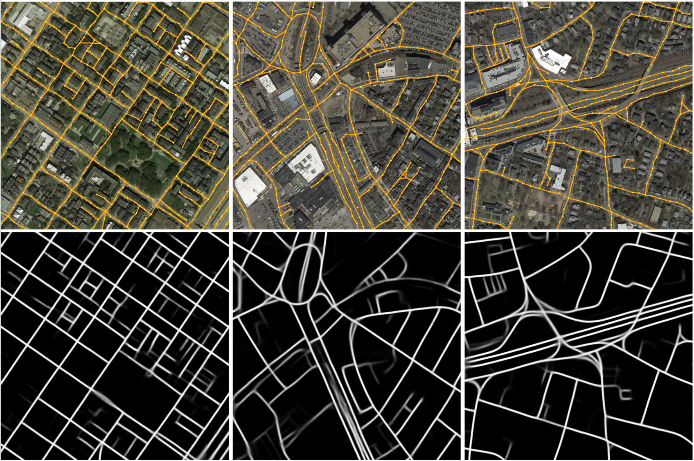

# Official codebase for "Segment Anything Model for Road Network Graph Extraction"
https://arxiv.org/pdf/2403.16051.pdf

The paper has been accepted by IEEE/CVF Computer Vision and Pattern Recognition Conference (CVPR) 2024, 2nd Workshop on Scene Graphs and Graph Representation Learning.

## Demos
Predicted road network graph in a large region (2km x 2km).


Predicted road network graphs and corresponding masks in dense urban with complex and irregular structures.


## Installation
You need the following:
- an Nvidia GPU with latest CUDA and driver.
- the latest pytorch.
- pytorch lightning.
- wandb.
- Go, just for the APLS metric (we should really re-write this with pure python when time allows).
- and pip install whatever is missing.


## Getting Started

### SAM Preparation
Download the ViT-B checkpoint from the official SAM directory. Put it under:  
-sam_road  
--sam_ckpts  
---sam_vit_b_01ec64.pth  

### Data Preparation
Refer to the instructions in the RNGDet++ repo to download City-scale and SpaceNet datasets.
Put them in the main directory, structure like:  
-sam_road  
--cityscale  
---20cities  
--spacenet  
---RGB_1.0_meter  

and run python generate_labes.py under both dirs.

### Training
City-scale dataset:  
python train.py --config=config/toponet_vitb_512_cityscale.yaml  

SpaceNet dataset:  
python train.py --config=config/toponet_vitb_256_spacenet.yaml  

You can find the checkpoints under lightning_logs dir.

### Inference
python inferencer.py --config=path_to_the_same_config_for_training --checkpoint=path_to_ckpt  
This saves the inference results and visualizations.

### Test
Go to cityscale_metrics or spacenet_metrics, and run  
bash eval_schedule.bash  

Check that script for details. It runs both APLS and TOPO and stores scores to your output dir.

## Citation
```
@article{hetang2024segment,
  title={Segment Anything Model for Road Network Graph Extraction},
  author={Hetang, Congrui and Xue, Haoru and Le, Cindy and Yue, Tianwei and Wang, Wenping and He, Yihui},
  journal={arXiv preprint arXiv:2403.16051},
  year={2024}
}
```

## Acknowledgement
We sincerely appreciate the authors of the following codebases which made this project possible:
- Segment Anything Model  
- RNGDet++  
- SAMed  
- Detectron2  

## TODO List
- [x] Basic instructions
- [x] Organize configs
- [ ] Add dependency list
- [x] Add demos
- [ ] Add trained checkpoints


